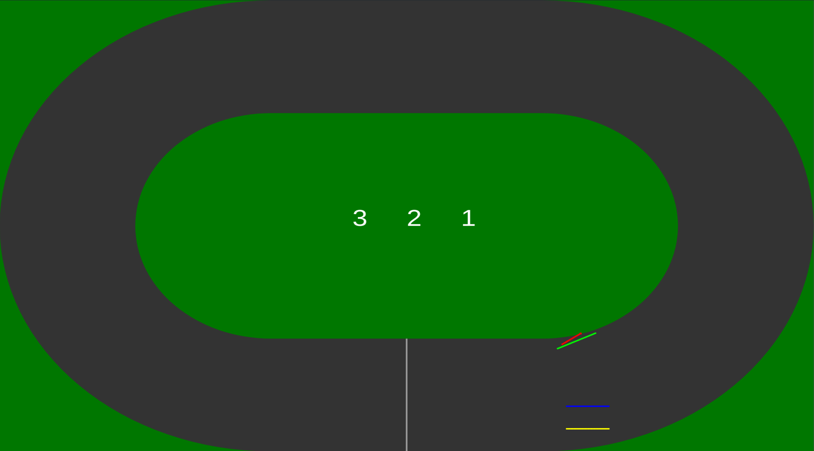

# KRESKI

Old school speedway web implemenation.



## Init

```
npm install
```

## Start:

```
npm run dev
```

the above command should open a web browser with the game

## Controls

- `enter` - to start the game
- refresh the page - to restart the game
- `q` - player 1 turning key
- `/` - player 2 turning key
- `v` - player 3 turning key
- `u` - player 4 turning key
- `z` - player 5 turning key
- `m` - player 6 turning key
- `r` - player 7 turning key
- `]` - player 8 turning key

